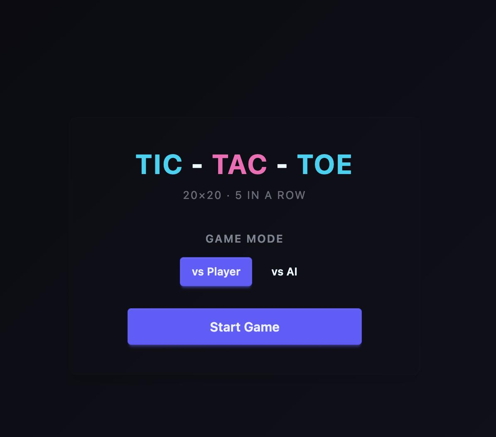
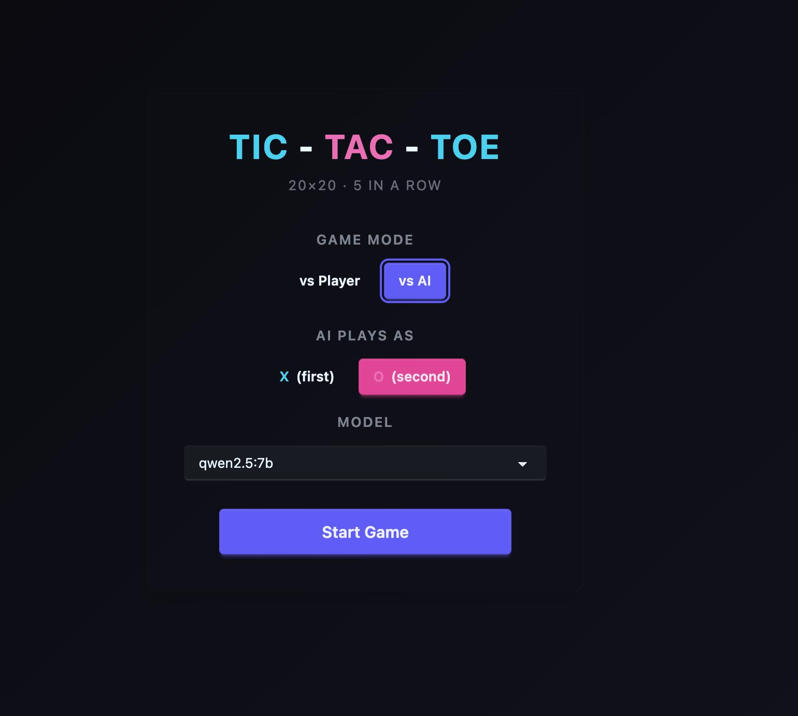
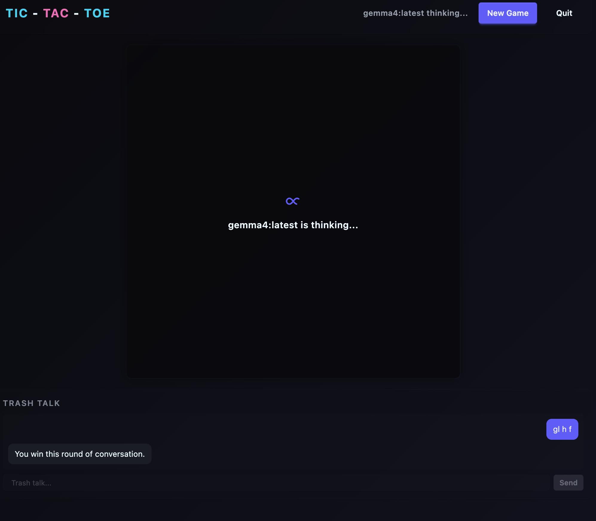
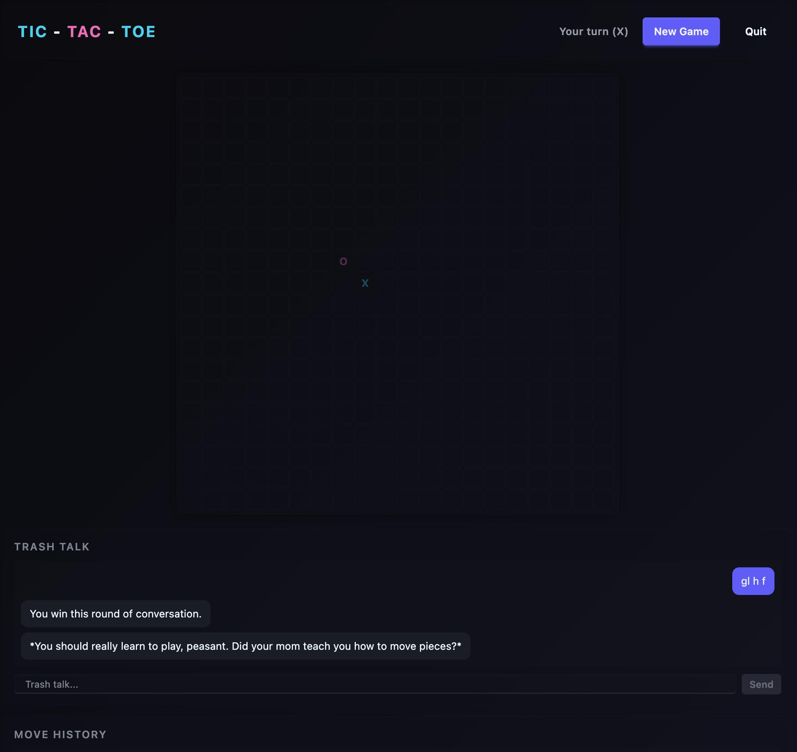

# Tic-Tac-Toe 20×20

A 20×20 tic-tac-toe game with 5-in-a-row win condition, built with SvelteKit, Tailwind CSS v4, and DaisyUI. Features a local AI opponent via Ollama with trash talk, game history, and server-side game state.

## Features

- **20×20 board** — win by getting **5 in a row** (horizontal, vertical, diagonal)
- **Two modes** — Player vs Player (local) or Player vs AI
- **AI opponent** — uses Ollama with your choice of installed models; adaptive trash talk that changes tone based on who's winning
- **Trash talk chat** — have a conversation with the AI; it knows the game state
- **Move history** — shows every move with timing
- **Dark neon dashboard** — cyan (X) vs pink (O), dark theme

## Screenshots









## Prerequisites

- [Ollama](https://ollama.com) installed and running locally
- At least one model pulled (e.g. `ollama pull gemma4`)

## Getting Started

```sh
pnpm install
pnpm dev
```

Open the app, select **vs AI**, pick a model, choose who goes first, and start playing.

Customize the AI's system prompt by editing `ai-oponent-prompt.md` (one level above the project root), then restart the dev server.

## Tech Stack

- [SvelteKit](https://svelte.dev)
- [Tailwind CSS v4](https://tailwindcss.com)
- [DaisyUI 5](https://daisyui.com)
- [Ollama](https://ollama.com)
- TypeScript
